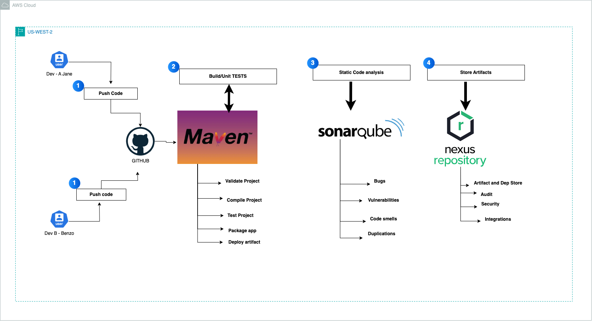

# Sonarqube-learning-repo
- This repo is maintained by [Devops with Mike](https://www.youtube.com/@DevOpsWithMike0/videos/)
- For interview preparation, use this platform [Wandaprep](http://www.wandaprep.com/)
- Visit my website for more inquiries and support [DevOpswithMike](https://devopswithmike.tech/).

## Introduction
SonarQube is an open-source platform for continuous code quality and security analysis. It inspects source code, looking for bugs, vulnerabilities, code smells, and technical debt across a wide range of programming languages. SonarQube integrates with existing DevOps tools and CI/CD pipelines to provide real-time feedback on code health, allowing development teams to address issues proactively and enforce quality standards.

## Key Features
* **Comprehensive Code Analysis**: Detects code issues like bugs, vulnerabilities, code smells, and duplications.
* **Quality Gates**: Enforces a set of configurable thresholds that code must meet before merging.
* **Multi-Language Support**: Analyzes over 25 programming languages, including Java, Python, JavaScript, and C++.
* **Security Scanning**: Identifies security vulnerabilities using industry standards (OWASP, CWE).
* **Technical Debt Management**: Calculates “technical debt” to indicate how much time is needed to fix identified issues.
* **Developer-Centric**: Provides detailed issue descriptions and suggestions for fixing code.
* **Customizable Rules**: Allows customization of code analysis rules to suit specific project requirements.
* **Integration with DevOps Tools**: Seamlessly integrates with CI/CD tools like Jenkins, GitLab CI, and GitHub Actions.

## Use Cases
- **Code Quality Management**
SonarQube helps ensure that code meets quality standards by identifying code smells, bugs, and duplications, aiding in maintaining cleaner, more maintainable codebases.

- **Security Auditing**
SonarQube scans for security vulnerabilities and weaknesses in code, helping organizations detect and address security issues early in the development cycle.

- **Technical Debt Tracking**
By identifying areas of code that need improvement, SonarQube quantifies technical debt, helping teams prioritize refactoring efforts and reduce maintenance costs.

## Continuous Integration & Continuous Delivery (CI/CD)
Integrating SonarQube into CI/CD pipelines ensures that only code meeting predefined quality gates is promoted to production, maintaining high standards throughout the development lifecycle.

### SonarQube Integration with Maven
SonarQube can be integrated with Maven projects to enable automated code quality analysis. The sonar-maven-plugin allows Maven to scan code and send results to a SonarQube server, providing insights directly into the development process.

- *Adding SonarQube to Maven `pom.xml`*
To set up SonarQube analysis in a Maven project, add the SonarQube plugin to your `pom.xml`:

```<build>
    <plugins>
        <plugin>
            <groupId>org.sonarsource.scanner.maven</groupId>
            <artifactId>sonar-maven-plugin</artifactId>
            <version>3.9.1.2184</version>
        </plugin>
    </plugins>
</build>
```

- *Running SonarQube Analysis*
After configuring the plugin, you can run the SonarQube scan using the following command. Replace `your_project_key`, `sonar_host_url`, and `sonar_token` with your actual SonarQube project key, SonarQube server URL, and `authentication token`:


```mvn sonar:sonar \
    -Dsonar.projectKey=your_project_key \
    -Dsonar.host.url=http://localhost:9000 \
    -Dsonar.login=your_sonarqube_token
```

- *Configuring Authentication in `settings.xml`*
To store authentication securely, configure your SonarQube credentials in Maven’s `settings.xml` file:

```<settings>
    <servers>
        <server>
            <id>sonar</id>
            <username>your_sonar_username</username>
            <password>your_sonar_token</password>
        </server>
    </servers>
</settings>
```

## Maven Lifecycle Phases
When integrated with Maven, SonarQube can utilize the Maven build lifecycle to perform code analysis at various stages. Here’s a breakdown of the main phases used in a SonarQube-enabled Maven project:

* validate: Ensures that the project is correct and that all required information is available.
* `compile`: Compiles the source code of the project.
* `test`: Runs unit tests using the appropriate testing framework.
* `package`: Packages the compiled code into a distributable format (e.g., JAR).
* `verify`: Runs checks on the packaged software to ensure its quality.
* `install`: Installs the package into the local repository.
* `deploy`: Copies the package to a remote repository for team-wide distribution.
The `sonar:sonar` goal can be run after the verify or install phase to ensure that only quality-checked code proceeds to deployment.

### Integrating SonarQube with DevOps Tools
1. **Jenkins**
SonarQube integrates with Jenkins to automate code quality checks in CI/CD pipelines. By adding the SonarQube step in a Jenkins pipeline, teams can automatically analyze code quality on each build.

```
pipeline {
    agent any
    stages {
        stage('Build') {
            steps {
                sh 'mvn clean install'
            }
        }
        stage('SonarQube Analysis') {
            steps {
                withSonarQubeEnv('SonarQube') {
                    sh 'mvn sonar:sonar'
                }
            }
        }
        stage('Quality Gate') {
            steps {
                waitForQualityGate abortPipeline: true
            }
        }
    }
}
```

2. **GitHub Actions**
SonarQube can be integrated with GitHub Actions for continuous analysis of pull requests. This integration ensures that only high-quality code is merged into the main branch.

```
name: Java CI with SonarQube
on: [push, pull_request]
jobs:
  build:
    runs-on: ubuntu-latest
    steps:
    - uses: actions/checkout@v2
    - name: Set up JDK 11
      uses: actions/setup-java@v2
      with:
        java-version: '11'
    - name: Build with Maven
      run: mvn clean install
    - name: SonarQube Scan
      run: mvn sonar:sonar -Dsonar.projectKey=my_project \
            -Dsonar.host.url=$SONAR_HOST_URL \
            -Dsonar.login=$SONAR_TOKEN
      env:
        SONAR_HOST_URL: ${{ secrets.SONAR_HOST_URL }}
        SONAR_TOKEN: ${{ secrets.SONAR_TOKEN }}
```

3. **GitLab CI/CD**
In GitLab, add a SonarQube analysis step to your .gitlab-ci.yml file to automatically scan for issues whenever code is pushed or merged.

```
sonar_scan:
  image: maven:3.8.1-jdk-11
  script:
    - mvn clean install sonar:sonar -Dsonar.projectKey=my_project
  variables:
    SONAR_HOST_URL: "http://localhost:9000"
    SONAR_LOGIN: $SONAR_TOKEN
```

4. **Azure DevOps**
SonarQube can be used in Azure DevOps pipelines to scan code quality during the build process. With the SonarQube extension for Azure DevOps, you can add a SonarQube step to your pipeline.

```
- task: SonarQubePrepare@4
  inputs:
    SonarQube: 'SonarQubeServiceConnection'
    projectKey: 'my_project_key'
    projectName: 'My Project'
- task: Maven@3
  inputs:
    mavenPomFile: 'pom.xml'
    goals: 'clean install sonar:sonar'
    options: '-Dsonar.projectKey=my_project_key'
    publishJUnitResults: true
    testResultsFiles: '**/surefire-reports/TEST-*.xml'
```

By integrating SonarQube with these DevOps tools, teams can automate code quality checks, enforce quality gates, and ensure that only high-quality code is deployed to production.

# Development Environment Project


###### Project ToolBox 🧰
- [Git](https://git-scm.com/) Git will be used to manage our application source code.
- [Github](https://github.com/) Github is a free and open source distributed VCS designed to handle everything from small to very large projects with speed and efficiency
- [Maven](https://maven.apache.org/) Maven will be used for the application packaging and building including running unit test cases
- [SonarQube](https://docs.sonarqube.org/) SonarQube Catches bugs and vulnerabilities in your app, with thousands of automated Static Code Analysis rules.
- [Nexus](https://www.sonatype.com/) Nexus Manage Binaries and build artifacts across your software supply chain
- [EC2](https://aws.amazon.com/ec2/) EC2 allows users to rent virtual computers (EC2) to run their own workloads and applications.

## Configure Environments
1) **Create a GitHub Repository**
    - Navigate to https://github.com
    - Click on Repositories
    - Click on `Create` to Create a Repository
     - Repository Name: maven-learning-project
     - Click on `Create`
     - Download the Project Zip from https://github.com/devopsmike-01/maven-learning-repo.git
     - Unzip and Push the code to the Repository you just provisioned

2) **Setting up Maven Server**
    - Create an Amazon Linux 2 VM instance and call it "maven-server"
    - Instance type: t2.micro
    - Security Group (Open): 22 to 0.0.0.0/0 or Your-IP
    - Key pair: Select or create a new keypair
    - Follow the installation steps in this repo: https://github.com/devopsmike-01/sonarqube-learning-repo/blob/main/Installations/maven-install.md 
    - Launch Instance

3) **Nexus**
    - Create an Amazon Linux 2 VM instance and call it "Nexus-server"
    - Instance type: t2.medium
    - Security Group (Open): 8081 and 22 to 0.0.0.0/0
    - Key pair: Select or create a new keypair
    - User data (Copy the following user data): https://github.com/devopsmike-01/nexus-learning-repo/blob/main/Installations/nexus-installation.sh
    - Launch Instance

## Configure Nexus Repository
Series of tutorial code snippets for use
#Maven publish tutorial steps
Publishing artifact to Nexus snapshot and release repo using maven.

1. Create a snapshot repo using nexus, or use default coming in out of the box. DEFAULT 
2. Create a release repo using nexus, or use default coming out of the box. DEFAULT
3. Create a group repo having both release, snapshot and other third party repos. or use default coming out of the box.
4. Download spring initializer project
5. Go settings.xml under <MAVEN_INSTALL_LOCATION>\apache-maven-3.6.0\conf or C:\Users\<USER_NAME>\.m2  or mkdir ~/.m2
6. Create/Move profiles named snapshot and release in settings.xml in `~/.m2` (can be done in pom.xml as well)
7. Add server user name and pwd in setting.xml (Encrypted recommended).
8. Edit pom.xml and add repository and snapshot repository in distribution management tag DEFAULT/DONE
9. Mark id should match in step 7 with server id of settings.xml, UPDATE NEXUS IP
10. Run the following `maven`/`mvn` commands to validate/package/deploy your app artifacts remotely
   - `mvn validate`   (validate the project is correct and all necessary information is available.)
   - `mvn compile`    (compile the source code of the project)
   - `mvn test`       (run tests using a suitable unit testing framework. These tests should not require the code be packaged or deployed.)
   - `mvn package`    (take the compiled code and package it in its distributable format, such as a WAR/JAR/EAR.)
   - `mvn verify`     (run any checks to verify the package is valid and meets quality criteria.)
   - `mvn install`    (install the package into the local repository, for use as a dependency in other projects locally.)
   - `mvn deploy`     (done in an integration or release environment, copies the final package to the remote/SNAPSHOT repository 
                      for sharing with other developers and projects.)

11. Change the version from 1.0-Snapshot to 1.0
12. Run `mvn deploy` to deploy to Snapshot Repo or `mvn clean deploy -P release`, to deploy it to Release Repo

4) **SonarQube**
    - Create an Create an Ubuntu 22.04 VM instance and call it "SonarQube"
    - Instance type: t2.medium
    - Security Group (Open): 9000 and 22 to 0.0.0.0/0
    - Key pair: Select or create a new keypair
    - User data (Copy the following user data): https://github.com/devopsmike-01/sonarqube-learning-repo/blob/main/Installations/sonarqube-installation.sh
    - Launch Instance

## Happy Learning
